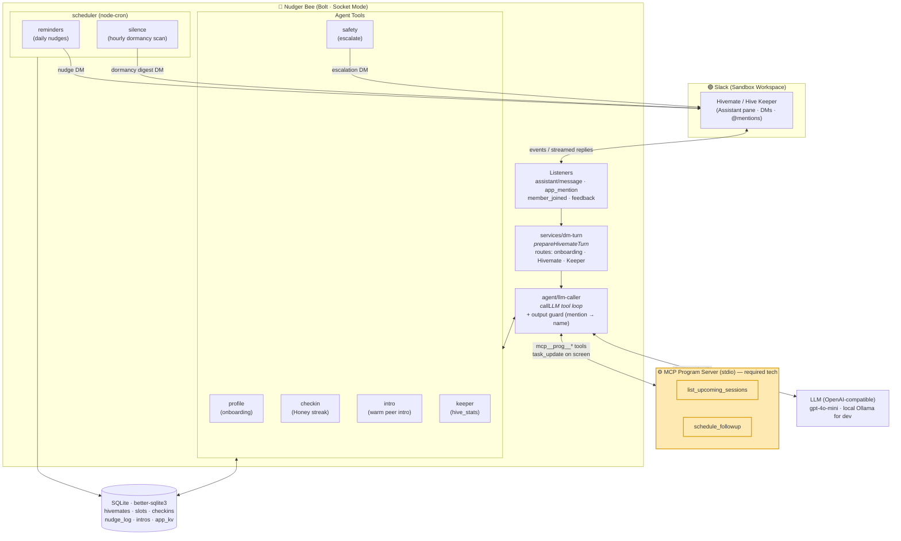

# Nudger Bee — Architecture

Render this to a PNG for the submission (see instructions at the bottom).



## What the judges should notice
- **MCP is a real client↔server link** (stdio). Every call renders a visible `task_update` step in Slack — the required-tech moment.
- **Safety is first-class**: `escalate_to_hive_keeper` DMs a human *and* writes a `nudge_log` row (`kind:'escalation'`), so the safety story lives in the data.
- **The bee stays a coordinator, never a clinician** — clinical questions are refused + escalated in any language.

## How to export this to a PNG
1. Open <https://mermaid.live>.
2. Paste everything between the ```` ```mermaid ```` fences above.
3. **Actions → PNG** (or SVG) → save as `docs/architecture.png`.
4. Attach that PNG to the Devpost submission and drop it in the README.

(GitHub also renders this diagram inline in the repo automatically.)
